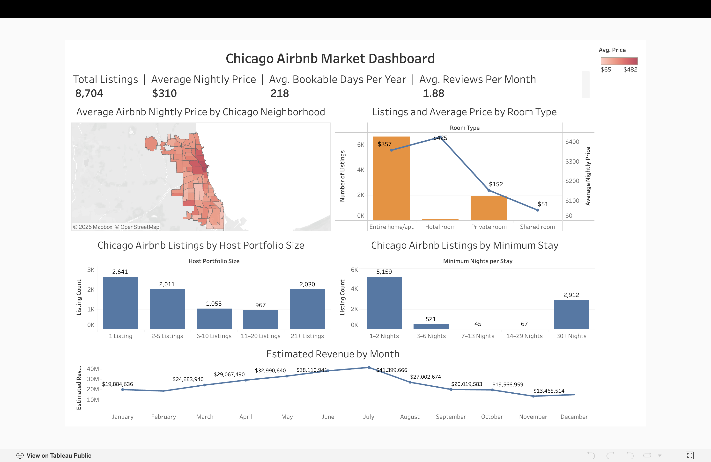

# Chicago Airbnb Market Dashboard + LLM Verification

A data analytics portfolio project with a twist: instead of just building a dashboard, I used it to test how well ChatGPT, Claude, Gemini, and Copilot analyze the same data, and where they get it wrong.

**The pitch:** AI tools make building an analysis easy now. The skill that actually matters is knowing what to build, catching AI's mistakes, and understanding the business impact of trusting a wrong AI answer. This project is a demonstration of that skill.

## The dashboard

Built in Tableau from 8,704 Chicago Airbnb listings (InsideAirbnb). It covers pricing by neighborhood, listing count and average price by room type, host portfolio concentration, minimum-stay distribution, and estimated revenue by month. Live version: [Chicago Airbnb Market Dashboard](https://public.tableau.com/views/ChicagoAirbnbMarkertDashboard/ChicagoAirbnbMarketDashboard?:language=en-US&:sid=&:redirect=auth&:display_count=n&:origin=viz_share_link)

## Data modeling

The dashboard joins `listings.csv` and `calendar.csv` on listing ID, combining static listing attributes (price, room type, host info) with per-date availability. Several metrics on the dashboard, including estimated revenue by month, host portfolio tiers, and minimum-stay buckets, are built from calculated fields on top of that joined data rather than raw columns.

## What's here

- **[VERIFICATION.md](./VERIFICATION.md):** full methodology, ground-truth findings, and a breakdown of every error I caught across four LLMs, with the business impact of trusting each one

## The dataset

Chicago Airbnb listing and calendar data (InsideAirbnb), 8,704 listings across 4 room types and 3,637 hosts.

## Ground-truth findings (verified by hand)

- **Room type:** Entire home/apt is the clear revenue leader ($357 avg/night, ~6,800 listings). Hotel room shows a higher average price ($425) but on a tiny, unrepresentative sample of just 70 listings. That's not a scalable opportunity for a new host.
- **Seasonality:** Estimated revenue (price times an availability-based occupancy estimate) swings over 3x across the year, from $13.5M in November to $41.4M in July.
- **Host portfolio:** The market is a mix of individual hosts (2,641 listings from single-listing hosts) and professionalized operators (2,030 listings held by hosts with 21+ properties each).

## The AI-verification test

I gave four LLMs (ChatGPT, Claude, Gemini, Copilot) the same raw dataset and asked the same business question a new host would ask: which room type should I prioritize, what should I expect for seasonality, and what does the host portfolio tell me about the market? No hints, no leading questions.

**Headline result:** all four correctly identified Entire home/apt as the priority. Where they diverged sharply was on seasonality, specifically how each one handled being asked a question the data couldn't fully answer. That divergence, and what it means for anyone trusting these tools blindly, is the subject of [VERIFICATION.md](./VERIFICATION.md).

## Tools

Tableau (dashboard), ChatGPT / Claude / Gemini / Copilot (verification test)